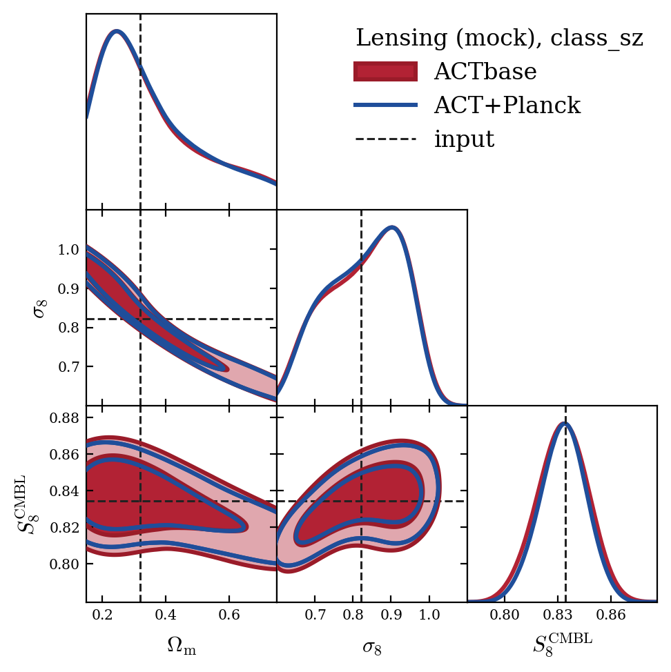
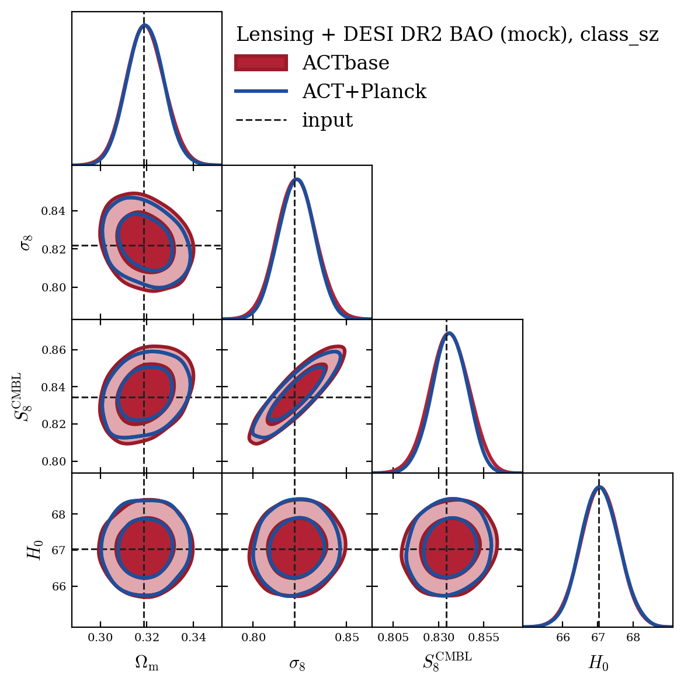
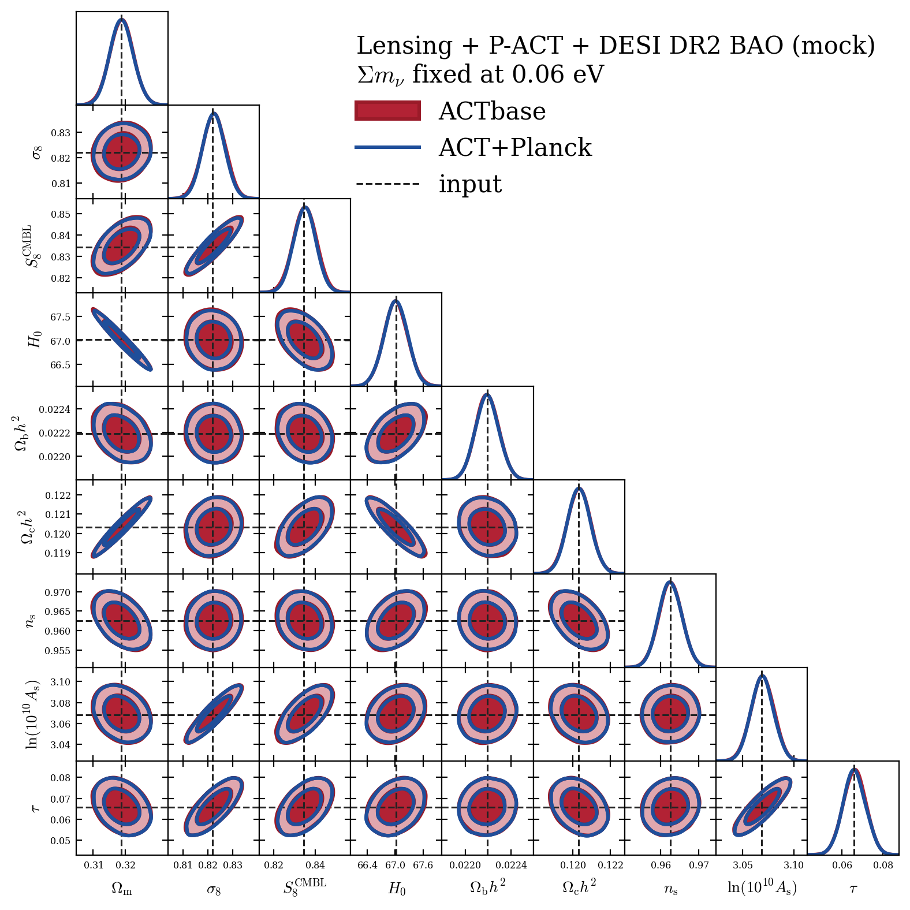
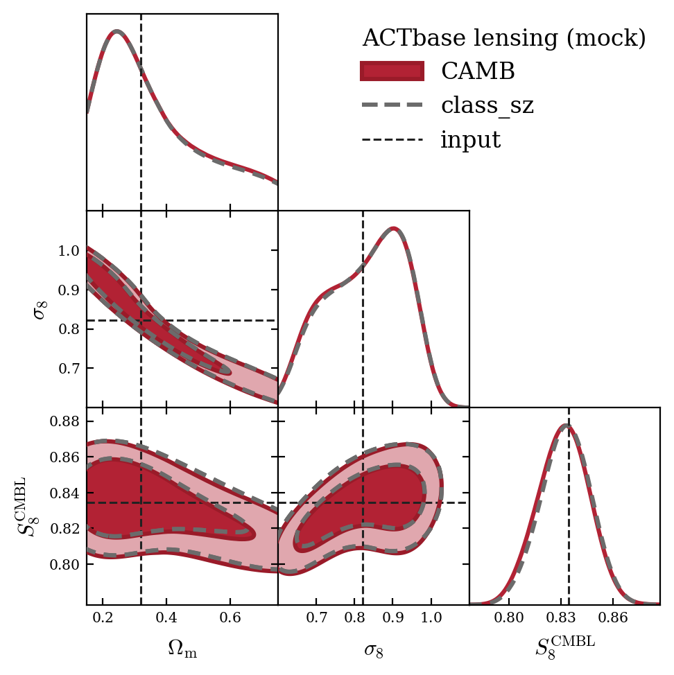
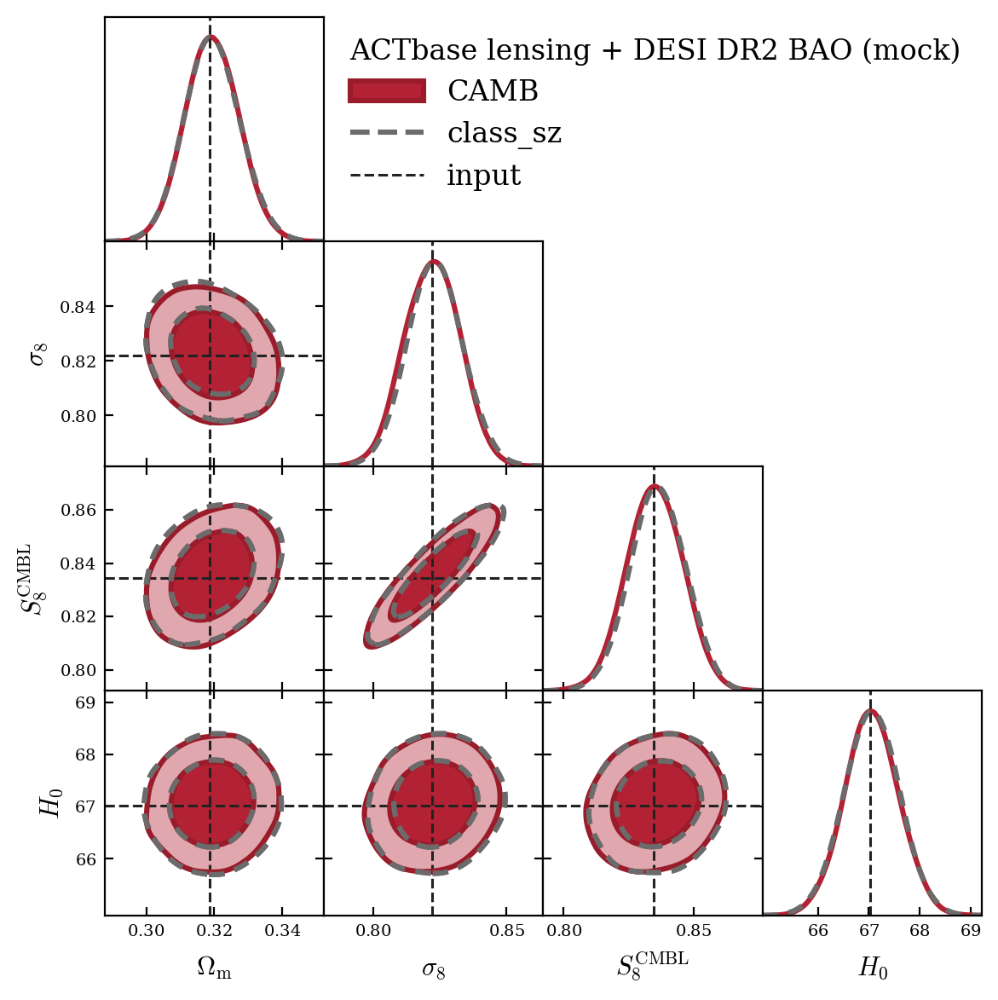

# Verification chains on the cosmo2017 mocks

Before running the Legacy extended-model chains, reproduce these reference chains.
Every data vector is a noiseless mock at one known cosmology, the
`cosmo2017_10K_acc3` fiducial of the DR6 lensing simulations, so a correct setup
recovers it: in our runs every constrained parameter lies within 0.23 sigma of its
input value.

## What to run

| config (`yaml/`) | data | theory |
|---|---|---|
| `{actbase,act_planck}_lens_classsz` | DR6+ lensing | class_sz |
| `{actbase,act_planck}_lensbao_classsz` | DR6+ lensing + DESI DR2 BAO | class_sz |
| `{actbase,act_planck}_lenscmbbao_camb` | DR6+ lensing + P-ACT lite + DESI DR2 BAO | CAMB |

`actbase` is DR6plus_lensing variant 9h (ACT-only HILC plus the daytime legs),
`act_planck` is 9a (ACT+Planck HILC plus the daytime legs). `yaml/` also holds a
CAMB cross-check of the class_sz chains (`*_lens_camb`, `*_lensbao_camb`) and the
joint chain with Sum m_nu free (`*_lenscmbbao_mnu_camb`); these need not be
reproduced.

From the repository root, set your clone and output paths, then run each config
with cobaya (the yaml files are the ones we ran, with the two paths replaced by
placeholders):

    sed -i "s|REPO_ROOT|$PWD|g; s|OUTPUT_ROOT|/scratch/$USER/chains/verification|g" runs/verification/yaml/*.yaml
    mpirun -n 8 cobaya-run -r runs/verification/yaml/actbase_lens_classsz.yaml

This needs classy_szfast (class_sz), CAMB built with CosmoRec and
`act_dr6_cmbonly` (DR6-ACT-lite). On one Trillium node (8 MPI chains of 24
threads) the class_sz chains converge (R-1 < 0.01) in about 4 min and the joint
CAMB chains in about 7 h.

## Data and priors

All mocks are the likelihoods' own predictions at the input point with the real
covariances (construction in `tests/mock/README.md`); the lensing likelihood runs
with `mock: true`, and the blinded variants refuse their measured bandpowers
otherwise. The real low-ell Planck likelihoods are replaced by a prior tau ~
N(0.0657, 0.0065), since the real SRoll2 EE data sit 1.4 sigma below the input
tau. Lensing alone and with BAO use the lens-only likelihood with the variant's
analytic CMB-marginalized covariance and the priors of the ACT DR6 lensing runs
(n_s and Omega_b h^2 Gaussians centred on the input, tau and Sum m_nu fixed). The
joint chains use the full lensing likelihood, with the CMB correction evaluated on
the map-frame spectra (`map_frame_cal: true`), the P-ACT LCDM priors, the
calibration prior A_act ~ N(1, 0.003), and Sum m_nu fixed at 0.06 eV.

## What to expect

Input point: Omega_b h^2 = 0.022192, Omega_c h^2 = 0.12031, 100 theta_MC =
1.04073, ln(10^10 A_s) = 3.0685, n_s = 0.9625, tau = 0.0657, Sum m_nu = 0.06 eV
(one massive state).

| config | S_8^CMBL | sigma_8 | Omega_m | H_0 |
|---|---|---|---|---|
| input (CAMB) | 0.83444 | 0.82196 | 0.31865 | 67.02 |
| input (class_sz convention) | 0.83304 | 0.82151 | 0.31721 | 67.02 |
| actbase_lens_classsz | 0.8319 +/- 0.0145 | prior | prior | prior |
| act_planck_lens_classsz | 0.8321 +/- 0.0131 | prior | prior | prior |
| actbase_lensbao_classsz | 0.8352 +/- 0.0107 | 0.8232 +/- 0.0104 | 0.3180 +/- 0.0082 | 67.06 +/- 0.55 |
| act_planck_lensbao_classsz | 0.8352 +/- 0.0096 | 0.8232 +/- 0.0096 | 0.3180 +/- 0.0078 | 67.06 +/- 0.55 |
| actbase_lenscmbbao_camb | 0.8350 +/- 0.0056 | 0.8224 +/- 0.0047 | 0.3188 +/- 0.0037 | 67.02 +/- 0.26 |
| act_planck_lenscmbbao_camb | 0.8350 +/- 0.0053 | 0.8224 +/- 0.0045 | 0.3188 +/- 0.0036 | 67.01 +/- 0.25 |

Means and 68 per cent errors from getdist with the first 30 per cent of each chain
removed; S_8^CMBL = sigma_8 (Omega_m/0.3)^0.25. A reproduction should match these
means to about 0.1 sigma, the sampling scatter at R-1 = 0.01. In the joint chains
the primary-CMB parameters (Omega_b h^2, Omega_c h^2, theta_MC, ln(10^10 A_s), n_s,
tau) and A_planck, P_act all lie within 0.08 sigma of the input. Lensing alone
constrains only S_8^CMBL; sigma_8, Omega_m and H_0 follow the priors. class_sz
reports Omega_m without the massive neutrino, so its chains are compared with the
class_sz-convention inputs; the figures add omega_nu = 0.06/93.14 back.

## Figures

Input values as dashed lines.

CAMB cross-check of the class_sz chains (ACTbase):

